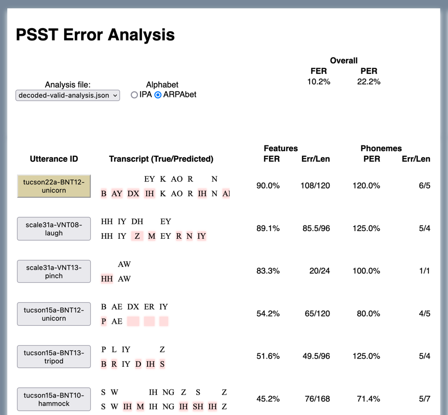

# `phonologic`

`phonologic` is a tool for building and process phonological feature systems. It was built with automatic speech 
recognition (ASR) / automatic phoneme recognition (APR) in mind.

With many similarities to the fantastic tool [`panphon`](https://github.com/dmort27/panphon), it allows for distance calculations to be
computed between strings of phonemes. One major enhancement, though, is the ability to obtain a step-by-step trace of
the computation.

We also include a tool `phonologic-viewer` to visually trace and explore phonological feature comparisons.

### Table of Contents

1. [Installation](#installation)
2. [Distance Calculations](#distance-calculations)
3. [Feature Systems](#feature-systems)
   1. [Included Systems](#included-systems)
   2. [Composing/modifying your own system](#composingmodifying-your-own-system)
   3. [Diphthongs](#diphthongs)
4. [`phonologic-viewer` - an interactive phonological distance viewer](#phonologic-viewer---an-interactive-phonological-distance-viewer)


## Installation

With python installed, `phonologic` can be installed with pip like so:

```python
pip3 install phonologic
```

## Distance calculations

We're 
using phonological features to position phonemes in a vector space, which allows us to estimate 
"distances" between phonemes. In contrast to a metric like phoneme error rate (PER), which 
only tells us whether each phoneme was correct/incorrect, feature distance gives us a finer-grained look at how close
a transcript was to our expectations. For example, if our target is /bɹʌʃ/ "brush", but an APR suggests /bʊʃ/ "bush", 
a phoneme-level edit distance would count one deletion and one substitution for two errors. However, we're interested in 
a more nuanced difference between /ʌ/ and /ʊ/, which according to the Hayes system adds three features: 
[+labial, +high, +round]. 


## Feature systems

### Included systems

So far there are two (closely related) systems: `"hayes"` and `"hayes-arpabet"`. The former, based on the Hayes (2009) 
textbook, covers most (though certainly not all) of the IPA (`panphon`'s coverage is much more complete). The latter is
is the same phonological theory, but only covers the ARPAbet symbols used in the standard TIMIT inventory. While 
`"hayes"` uses 26 features to fully distinguish its inventory, the General American English focus of ARPAbet suggests
a need for fewer, so `constrictedglottis` and `trill` are unused and thus removed. The ARPAbet system could be much 
further reduced (I've confirmed the inventory can be fully distinguished with 16 symbols), but choosing a feature set
is likely to be rather task-specific, so this is left as an exercise for the user (refer to the next section).

### Composing/modifying your own system

While `phonologic` was meant to be useful off-the-shelf, it was also designed to simplify the process of assembling a
system from scratch, or modifying a system. Have a look at [phonologic/systems/hayes.phl](phonologic/systems/hayes.phl).
The file begins with a declaration of `<default>`, identifying a template that must be compeleted by every symbol in the
inventory:

```
<default> = [?voice, ?syllabic, ?consonantal, ?approximant, ?sonorant, ?continuant, -tap, -trill, -nasal, -spreadglottis, -constrictedglottis, ?labiodental, ?coronal, ?delayedrelease, ?dorsal, ?labial, ?lateral, ?anterior, ?distributed, ?high, ?low, ?strident, ?round, ?tense, ?front, ?back]
```

Each feature is preceded by a modifier. In phonological feature theory, the symbols `+`, `-`, and `0` represent present,
absent, and a notion of irrelevance. Here we add `?`, which indicates "yet to be defined."

Up next, `hayes.phl` defines some natural classes. For this system, the classes were determined using the description 
laid out in Hayes (2009), while filling in some implied details along the way. For example, we have definitions for 
manners of articulation:

```python
<glide> =     [-syllabic, -consonantal, +approximant, +sonorant, +continuant, 0delayedrelease]
<liquid> =    [-syllabic, +consonantal, +approximant, +sonorant, +continuant, 0delayedrelease]
<nasal> =     [-syllabic, +consonantal, -approximant, +sonorant, -continuant, 0delayedrelease, +nasal]
<fricative> = [-syllabic, +consonantal, -approximant, -sonorant, +continuant, +delayedrelease]
<affricate> = [-syllabic, +consonantal, -approximant, -sonorant, -continuant, +delayedrelease]
<stop> =      [-syllabic, +consonantal, -approximant, -sonorant, -continuant, -delayedrelease]
```

...as well as each place of articulation:

```
<bilabial> =           [+labial, -round, -labiodental, -coronal, 0anterior, 0distributed, 0strident, -lateral, -dorsal, 0high, 0low, 0front, 0back, 0tense]
<labiodental> =        [+labial, -round, +labiodental, -coronal, 0anterior, 0distributed, 0strident, -lateral, -dorsal, 0high, 0low, 0front, 0back, 0tense]
<dental> =             [-labial, -round, -labiodental, +coronal, +anterior, +distributed, -strident, -lateral, -dorsal, 0high, 0low, 0front, 0back, 0tense]
<alveolar> =           [-labial, -round, -labiodental, +coronal, +anterior, -distributed, -strident, -lateral, -dorsal, 0high, 0low, 0front, 0back, 0tense]
<palatoalveolar> =     [-labial, -round, -labiodental, +coronal, -anterior, +distributed, +strident, -lateral, -dorsal, 0high, 0low, 0front, 0back, 0tense]
# ... and so on
```

We also have simple voicing classes defined:

```
<voiceless> = [-voice]
<voiced> = [+voice]
```

These are frankly unnecessary, but I liked the way it looked, because this gives us the option to compose a phoneme
descriptively:

```
ʃ = <voiceless> <palatoalveolar> <fricative>
ʒ = <voiced> <palatoalveolar> <fricative>
```

Though explicit feature modifications sometimes make more sense, like this rhotic, which is exceptional as a
palatoalveolal with [-strident]:

```
ɹ = <voiced> <palatoalveolar> <glide> [-strident]
```

We can also compose a phoneme from other phonemes:

```
ɝ = ɹ [+syllabic]
```

### Diphthongs

A peculiar thing happens when we get to diphthongs. We find two new feature modifiers: `+-` and `-+`, meaning 
"high-to-low" and "low-to-high":

```
a͡ʊ = a [-+high, +-low, -+back, -+round]
a͡ɪ = a [-+high, +-low, -+front]
e͡ɪ = e [-+high, +-tense]
o͡ʊ = o [-+high, +-tense]
ɔ͡ɪ = ɔ [-+high, -+front, +-back, +-round]
```

This is probably somewhere between useless and blasphemous in phonology, but as mentioned above, `phonologic` was built 
with ASR in mind. But our primary goal isn't to minimally distinguish phonemes across the world's languages. Rather, we
want to approximate distances between transcripts in a single language—General American English, presently—so we've 
built `phonologic` to better align with our intuitions in that respect. Without special treatment of diphthongs, we 
might consider each part of the diphthong separately, so /e͡ɪ/ becomes /e/ and /ɪ/. This creates a major problem for 
phoneme comparisons: any comparison between a monophthong and diphthong (and vice versa) will always be at least a full 
phoneme apart.

For example, consider the distance from /kɔl/ "call" to /ko͡ʊl/ "coal". These two words are a minimal pair 
distinguished only by their vowels: /ɔ/ versus /o͡ʊ/. If we treat /o͡ʊ/ as two phonemes during distance calculation, 
we can go from /ɔ/ to /o/ with only [+tense], but then we must suffer the cost of a full /ʊ/ insertion.

So what can we do about it? Well, when an English speaker says /a͡ɪ/ (like in "buy"), they will begin somewhere near /a/ 
but they'll probably never make it to /ɪ/. (The details vary widely with dialect, though. See Ladefoged and Johnson 
2015, pp. 97-99.) A pattern holds for all the English diphthongs listed above: the first vowel is the primary sound, and
the second vowel indicates direction more than destination. So as we approximate diphthongs in feature space,  we place
them primarily in the space of the first vowel, then we move toward the second phoneme, but only by a *half-feature*. 

We'll admit this feels like a hack, and we hope to learn how to improve upon it, but sometimes a hack is how to get a 
job done. We also note that a "phonological distance" is not a precise measure of acoustic/perceptual similarity to 
begin with.

Here's some code for the "call"/"coal" example. With the diphthong split, we can see the cost of [+tense] is 1/26 (about
0.038), but the insertion brings a cost of 24/26 (about 0.923). Computing the distance using our half-feature rules, we


```python
import phonologic
system = phonologic.load("hayes")

# If we split diphthongs:

analysis = system.analyze_feature_errors("kɔl", "ko ʊl")  # a space splits the diphthong for demonstration purposes
for step in analysis.steps:
    print(step)

#### Output:
# PhonologicalActionStep(action=EQ, expected='k', actual='k', cost=0.0, features=FeatureCollection([]))
# PhonologicalActionStep(action=SUB, expected='ɔ', actual='o', cost=0.038461538461538464, features=FeatureCollection([+tense]))
# PhonologicalActionStep(action=INS, expected=None, actual='ʊ', cost=0.9230769230769231, features=FeatureVector([+voice, +syllabic, -consonantal, +approximant, +sonorant, +continuant, -tap, -trill, -nasal, -spreadglottis, -constrictedglottis, -labiodental, -coronal, 0delayedrelease, +dorsal, +labial, -lateral, 0anterior, 0distributed, +high, -low, 0strident, +round, -tense, -front, +back]))
# PhonologicalActionStep(action=EQ, expected='l', actual='l', cost=0.0, features=FeatureCollection([]))

# But if we treat diphthongs as one:

analysis = system.analyze_feature_errors("kɔl", "ko͡ʊl")
for step in analysis.steps:
    print(step)

#### Output:
# PhonologicalActionStep(action=EQ, expected='k', actual='k', cost=0.0, features=FeatureCollection([]))
# PhonologicalActionStep(action=SUB, expected='ɔ', actual='o͡ʊ', cost=0.038461538461538464, features=FeatureCollection([-+high, +-tense]))
# PhonologicalActionStep(action=EQ, expected='l', actual='l', cost=0.0, features=FeatureCollection([]))

```


## `phonologic-viewer` - an interactive phonological distance viewer

The `phonologic-viewer` tool gives you a chance to visually explore a phonological distance computation. 
Please note that we provide no guarantee of support, but we hope you find it helpful, informative, and perhaps 
even fun!

For input, we'll need an input file. The tool expects a file in tab-separated (.tsv) or comma-separated (.csv) format,
with the first three columns containing an index/name, a reference transcript, and a transcript to compare to the 
reference, respectively. An example file can be found at [docs/example_file.tsv](docs/example_file.tsv). If you place
the file in your current directory, you can run the viewer with the command:

```python
phonologic-viewer --system hayes-arpabet example_file.tsv
```

Note that the example file uses ARPAbet, so the `hayes-arpabet` system is specified. If no system is specified, the 
`hayes` (IPA) system is used by default.

The command starts a local web server at `http://localhost:8000`. If you navigate to that URL, you can explore your results in
an interactive way. Your transcripts with the highest FER appear first.



If you click on an Utterance ID from the table, you can see a full trace of the feature distance 
computation. 
Also, hover over the feature names in a trace
to see the cost associated with it.

<strike>There's also an audio player to let you hear the utterance while you're looking at its trace.</strike> (audio player coming soon, just need to add it to the input file format)


